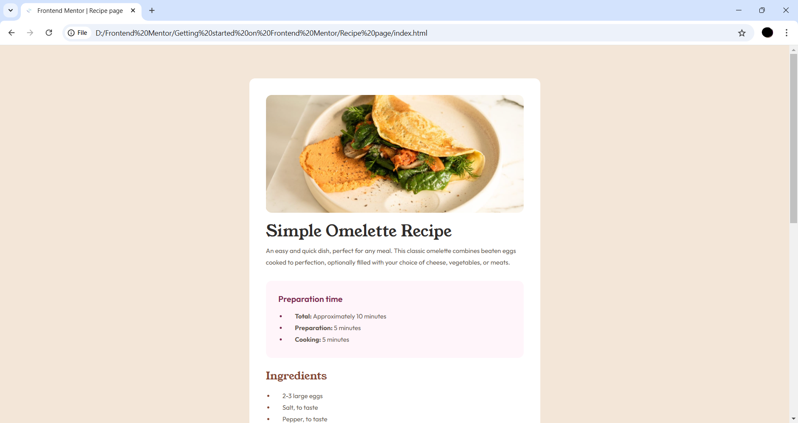

# Frontend Mentor - Recipe page solution

This is a solution to the [Recipe page challenge on Frontend Mentor](https://www.frontendmentor.io/challenges/recipe-page-KiTsR8QQKm). 

## Table of contents

- [Overview](#overview)
  - [Screenshot](#screenshot)
  - [Links](#links)
- [My process](#my-process)
  - [Built with](#built-with)
  - [What I learned](#what-i-learned)
  - [Continued development](#continued-development)
  - [Useful resources](#useful-resources)
- [Author](#author)
- [Acknowledgments](#acknowledgments)

## Overview

### Screenshot

### Links

- [Solution Repository]()
- [Live Demo]()

## My process

### Built with

- Semantic HTML5 markup
- CSS custom properties
- CSS Grid

### What I learned

During this project, I refined my skills in using CSS Grid for creating responsive layouts and gained a deeper understanding of applying CSS custom properties effectively.

### Continued development

Moving forward, I aim to:
- Explore advanced CSS layout techniques like Grid.
- Enhance my knowledge of accessibility to improve the user experience.
- Experiment with CSS animations and transitions in similar projects.

### Useful resources

- [w3schools](https://www.w3schools.com/) - A comprehensive resource for web development best practices and references.

## Author

- Portfolio - [Prashant Uniyal](https://resume8305.wordpress.com/)
- Frontend Mentor Profile - [@mod-prashant](https://www.frontendmentor.io/profile/mod-prashant)
- LinkedIn - [Prashant Uniyal](https://linkedin.com/in/prashant-uniyal-9ab235273/)

## Acknowledgments

I would like to thank the Frontend Mentor for providing this great learning opportunity and Frontend Mentor community for professional feedbacks.
